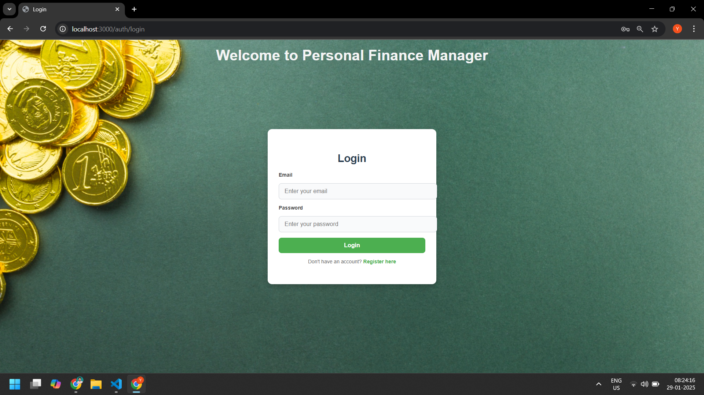

# Personal Finance Manager

## Description

Personal Finance Manager is a web application that helps users manage their income, expenses, transactions, and savings goals. Users can register, log in, track their financial activities, categorize transactions, generate reports, and set savings goals to achieve their financial objectives.

## Features

- User authentication (Login & Registration)
- Secure session management using Express Sessions
- Transaction tracking (Income & Expenses)
- Category management for transactions
- Savings goals tracking with progress updates
- Financial reports generation
- User-friendly dashboard with income/expense summaries

## Tech Stack

- **Backend:** Node.js, Express.js, MongoDB, Mongoose
- **Frontend:** EJS, HTML, CSS
- **Middleware:** express-session, connect-mongo, body-parser

## Installation

### Prerequisites

Ensure you have the following installed:

- Node.js
- MongoDB

### Steps to Install

1. Clone the repository:
   ```sh
   git clone https://github.com/your-username/finance-manager.git
   cd finance-manager
   ```
2. Install dependencies:
   ```sh
   npm install
   ```
3. Start MongoDB:
   ```sh
   mongod
   ```
4. Run the application:
   ```sh
   npm start
   ```
5. Open your browser and navigate to:
   ```sh
   http://localhost:3000
   ```

## Project Structure

```
PERSONALFINANCEMANAGER/
├── models/             # Mongoose models (User, Transaction, Category, SavingsGoal)
├── routes/             # Route handlers (auth, transactions, categories, reports, savings goals)
├── views/              # EJS templates (dashboard, login, register, savings goals)
├── public/             # Static files (CSS, JS, images)
├── public/screenshots/ # Screenshots of application pages
├── app.js              # Main application file
├── package.json        # Project metadata and dependencies
├── README.md           # Documentation
```

## API Endpoints

### Authentication

- `POST /auth/register` - Register a new user
- `POST /auth/login` - Log in an existing user
- `GET /auth/logout` - Log out the user

### Transactions

- `GET /transactions` - Fetch all transactions for the logged-in user
- `POST /transactions/add` - Add a new transaction
- `POST /transactions/delete/:id` - Delete a transaction

### Categories

- `GET /categories` - Fetch all categories
- `POST /categories/add` - Add a new category
- `POST /categories/delete/:id` - Delete a category

### Savings Goals

- `GET /savingsgoals` - View all savings goals
- `POST /savingsgoals/add` - Add a new savings goal
- `POST /savingsgoals/update/:id` - Update progress on a savings goal
- `POST /savingsgoals/delete/:id` - Delete a savings goal

## Screenshots

Here are some screenshots of the application:

- **Dashboard:**  
  
- **Report:**  
  
- **Goal:**  
  
- **Login:**  
  
- **Registration:**  
  

## Author

Developed by **Saurav Kumar**

